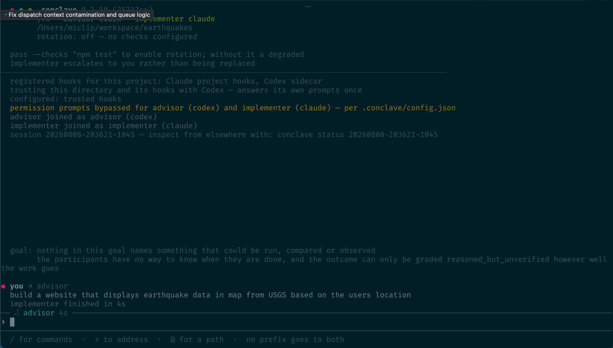

# Conclave

A REPL over coding-agent CLIs. One advises, one or more implement, a human steers.

The children are the real Claude Code, Codex, OpenCode and Kimi CLIs, unmodified. Their
harness, auth and usage accounting are the same as when you type at them yourself. Conclave
never speaks to a model API and never holds a model API key.

There is no orchestrator model and no summariser. The dispatcher is code.



`conclave demo` — scripted participants, real rendering.

The goal goes to the advisor only, and the advisor decides what the implementer needs to
know. The implementer then says two different things to two audiences: `implementer → you`
is narration, printed live; `implementer → advisor` is the report.

Why it is shaped this way, and what has been measured: [`docs/DESIGN.md`](docs/DESIGN.md).

## Supported REPLs

| agent id | CLI | how it is driven | registration it needs |
|---|---|---|---|
| `claude` | Claude Code | pty + hooks + transcript | generated `--settings`, and the folder trusted — both answered for you |
| `codex` | Codex CLI | pty + hooks + transcript | project `.codex/hooks.json`, and those hooks trusted in your user config |
| `opencode` | OpenCode | `run --format json` on stdout | none |
| `kimi` | Kimi CLI (needs a provider; access waitlisted) | `--print --output-format stream-json` | none |

Any of the four can take either seat:

```sh
conclave relay "<goal>" --advisor codex --implementer claude
```

The four are not equally well understood, and `npm run conformance` prints the difference
rather than hiding it. Claude Code and Codex announce turn completion through hooks;
OpenCode announces it in its output stream; **Kimi's print mode announces nothing**, so its
completions are inferred and graded accordingly. Kimi also cannot mediate permissions —
`--print` auto-approves for the invocation.

**Kimi needs a provider configured.** Without one the CLI exits 1 having printed
`LLM not set`, which grades as `unknown_abnormal_end (assumed)` from the exit code alone:

```sh
conclave session "<goal>" --implementer kimi \
  --implementer-args "--config-file ~/.kimi-conclave.toml"
```

### Registration

Claude Code and Codex need Conclave's hook registration; OpenCode and Kimi need none. A
session installs it for you, and Codex's trust gate is answered before launch:

```sh
conclave config install     # write the hook registration for this project
conclave config check       # is it present, current, and trusted
```

## Install

Node 24 or newer.

```sh
curl -fsSL https://raw.githubusercontent.com/miclip/conclave/v0.5.14/scripts/install.sh | sh
```

Installs the newest tagged release into `~/.local/share/conclave`, compiles `node-pty`, and
symlinks `conclave` into `~/.local/bin`. Re-running upgrades in place. `CONCLAVE_REF`
installs a specific ref; `CONCLAVE_PREFIX` and `CONCLAVE_BINDIR` move where it lands.

By hand:

```sh
git clone https://github.com/miclip/conclave.git && cd conclave
npm install
ln -sf "$PWD/bin/conclave.ts" ~/.local/bin/conclave
```

## Using it

Run it in the project you want worked on. Conclave registers its own hooks there; the
project needs nothing installed.

```sh
cd ~/some/project
conclave session "make the failing test pass" --checks "npm test"
```

The goal is optional — start with none and the first thing you type becomes it.

`--checks` enables rotation: a degraded implementer is replaced by one that reproduces the
verification first. Those checks are required, and a replacement that cannot reproduce one
is rolled back. `--checks-informational` and `--checks-unrelated` run and report without
gating the transfer. Relevance is declared by you, never by a participant.

With more than one seat the same checks also run against the merged tree after every merge,
including the last. A failure mid-run becomes a repair task naming both contributing tasks;
after the final merge the run ends `integration_failed` and exits non-zero.

### Seats

A run with more than one seat gives each its own agent and launch arguments in one flag:

```sh
conclave relay "<goal>" --advisor codex \
  --implementers "claude --model opus-5, opencode -m opencode/kimi-k2.7-code"
```

The comma is the seat boundary and the first word of each entry is the agent, or the name
of a [role](#roles). Everything after it belongs to that seat alone. Seats are named
`implementer`, `implementer-2`, … An argument containing a comma cannot be written here —
put it in `.conclave/config.json`, which is keyed by agent.

`--implementer-args`, `--advisor-args` and `--reviewer-args` apply to every seat of that
kind, and a seat's own arguments are applied after them so the seat's spelling wins.

Extra seats are opt-in, and what they turn on — worktrees, a merge boundary, a clean-base
refusal — turns on with them. One implementer creates no worktrees at all: the seat works in
your checkout, on your branch, and the merge is a no-op.

`--reviewer` adds a reviewer seat. It reads the diff and the tree, never the producing
seat's summary, and its rejection creates a repair task rather than authority.

### At the console

```
<text>                 to both, at human rank
>advisor <text>        to the advisor only
>implementer <text>    to the implementer only
>implementer-2 <text>  any seat, by the id it answers to — `/state` names them, and tab
                       completes them
@src/relay/relay.ts    a path. Tab completes both sigils.

/pause  /continue [message | force]  /wait [minutes]  /rotate [reason]  /abort
/allow [who]  /deny [who]
/state  /log [n]  /queue  /audit  /help  /exit
```

At a pause you may also just answer: a reply is delivered and resumes the run.
`/continue <message>` is the same thing said the other way round. `force` is the whole word
and nothing after it, so `/continue force it through` is a message, not an override.
`/continue` refuses while the child is measurably busy; `force` overrides it. `/wait`
records that you looked and chose to wait.

During a run an addressed line is queued and delivered at the next turn boundary — neither
CLI takes input mid-turn. Between runs the participants are still alive and an addressed
line is asked directly, so you get the answer back.

Permission prompts appear as `! advisor needs a permission decision for Bash — /allow or
/deny` and are answered from the console.

### Bounds

`--rounds` bounds how many times the advisor gets to steer, and is the only bound a run has
unless you set another. Four ceilings are separate from it, and all four stop a run that is
still going and exit non-zero:

| ceiling | bounds |
|---|---|
| `--max-turns` | advisor turns, whatever they cost |
| `--max-minutes` | time the run spends working; time suspended at a pause is not charged |
| `--max-queue-depth` | messages waiting to be delivered |
| `--max-concurrent-seats` | seats working at once |

A ceiling bounds the run; a deadline bounds a turn. `--turn-timeout` is how long a turn may
take before it is graded `timed_out`; `--silence-timeout` is how long it may go without
saying anything. Every launch prints what each bound is set to, and `status --json` carries
them.

Three flags exist for reproducing a fault rather than for ordinary use: `--settle` widens
how long a transcript is given to catch up with the hook that ended a turn, `--salvage` how
much longer an empty report buys, and `--record` tees the rendered bytes to a file.

`--dry-run` resolves configuration, checks and arguments and starts nothing. `--strict-goal`
refuses a goal with nothing observable in it instead of warning. `relay` refuses to run
outside a git repository unless you pass `--force`.

Every message is recorded to `.conclave/runs/` as it happens, and `--resume <log>` replays
it into both seats.

## Configuration

`.conclave/config.json`, per project, gitignored.

```json
{ "permissions": "bypass" }
```

Launches each CLI in its most permissive mode: `--dangerously-skip-permissions` for Claude
Code, `--dangerously-bypass-approvals-and-sandbox` for Codex, `--auto` for OpenCode. The
models then run commands in your working directory without asking, and the console reports
it at the top of the session. Each CLI's own wording is quoted in `src/config/project.ts`.

**Kimi has no entry**, because `kimi --print` auto-approves for the invocation and
`"permissions": "ask"` cannot be honoured for it.

Per agent:

```json
{ "permissions": "ask", "agents": { "claude": { "permissions": "bypass" } } }
```

`--bypass` on `relay` or `session` writes it for you, and `--bypass claude` scopes it to one
agent. It merges rather than replaces. Set `"permissions": "ask"` to undo.

### Roles

A role is a job a seat does, defined once and referenced by name:

```json
{
  "roles": {
    "frontend": {
      "description": "front-end UI work; React and Tailwind only, never touches migrations",
      "agent": "claude",
      "model": "sonnet"
    },
    "backend": { "description": "API handlers and migrations" }
  }
}
```

```sh
conclave session "<goal>" --implementers "frontend, backend"
```

`agent` and `model` are defaults the invocation overrides, so
`--implementers "frontend --model opus-5"` runs the same job on a different model. The
description is bounded at 400 characters: the advisor is told which seat is for what, and
the seat is told what its own job is.

An entry is looked up as a role first and as an agent otherwise, so `--implementers "claude"`
means what it always did. A role named after an agent or after a built-in (`advisor`,
`implementer`, `reviewer`, `arbiter`) is refused, and so is a name that is neither, at
startup and with both lists.

Roles live in this file, so they do not travel with the repository.

## Driving it as an agent

Use `conclave session`, not `conclave relay`. `relay` returns an outcome, so it has nowhere
to suspend to and every pause point ends the run. `--operator agent` does not change that.

```sh
conclave session "<goal>" --operator agent   # stdin stays open; the driver writes to it
conclave status --json                       # state: paused, with reason, evidence, options
```

`--operator agent` changes what the advisor is told about who is answering — escalate
readily about premises and ambiguous criteria, never about permission — and is recorded in
the run report.

Commands arrive on stdin as lines: `/continue`, `/rotate`, `/abort`, `/allow`, `/deny`, or a
message addressed with `>advisor` / `>implementer`. Nothing needs scraping off the console.

One line is one message, so a multi-paragraph answer needs framing. `<<TAG` opens a block
and a line equal to `TAG` closes it:

```sh
printf '>implementer <<EOF\n%s\nEOF\n' "$(cat answer.txt)" > "$fifo"
```

`conclave relay --json` prints the run as a structured record: the outcome, each turn's
verdict with its confidence and provenance, the rotation counters, and anything a
participant flagged. Every human-facing line moves to stderr, so stdout parses in full.

## Watching a session from somewhere else

Every session writes what it is doing to `.conclave/sessions/<id>/`, continuously, so it can
be read from another terminal, over ssh, or after the process is gone.

```sh
conclave relay "<goal>" --detach   # prints a session id and gives you your terminal back
conclave sessions                  # every session in this project, newest first
conclave status                    # what the most recent one is doing; a prefix picks another
conclave events <id> --follow      # its NDJSON stream: routed messages and adapter events
conclave guard                     # are participants live, and what changed since they started
```

`guard` exits non-zero while a participant is live, so a commit helper can gate on it.

`status` reports who is in each seat, what each is working on, whether either is stopped at
a permission prompt, the pause with its evidence and options, and the outcome once there is
one. `--json` gives the same record as data.

Liveness is never read from the file: every read checks the pid, so a run whose process is
gone shows as **abandoned** rather than as whatever it last claimed. A live session rewrites
its record every 30 seconds whether anything changed or not, so `updatedAt` means when the
file was last written. `status --json` grows a `stale` key only once the record has stopped
moving.

A detached run's stdout and stderr go to `stdio.log` in the same directory.

### Pruning old records

```sh
conclave sessions --prune              # ended, dead, and last updated over 7 days ago
conclave sessions --prune --days 30    # a longer horizon
conclave sessions --prune --days 0     # everything that qualifies, however recent
```

Pruning removes the whole session directory, and only for records meeting all three
conditions: the session ended, its process is no longer live, and it last updated before the
cutoff. Every id is printed before the first deletion, and each record is re-checked against
its pid immediately before its own removal.

Never removed, however old: a live session, a run that never said `ended`, anything at or
inside the cutoff, a record that cannot be read, and a directory with no `status.json`.

The argument list is read strictly — `--days` must be zero or more, and anything
unrecognised, repeated or positional is refused before a single record is chosen.

## Worktrees

Concurrent seats each work in their own git worktree under `.conclave/worktrees/`, and a
concurrent run refuses to start against a dirty tree, untracked files included.

Claude's hook registration is per-checkout, so linked worktrees are independent. Codex's is
not: it resolves project configuration from the **main** worktree, so one sidecar serves
every worktree of a project. A linked worktree still needs an empty `.codex/` directory as a
trigger, which `config install` creates.

If a second checkout of Conclave itself registers the same project, `config check` reports
`SHARED` rather than drifted and names the checkout whose hooks would run. To develop hook
changes, use a separate clone rather than a worktree.

In a seat worktree `config check` reports `not_applicable` and exits zero, because there is
no registration there to compare.

## As a library

`relay.run(goal)` is the unattended form, where every pause ends the run. `relay.start(goal)`
suspends and hands back.

```ts
const relay = await Relay.start({
  registry: defaultRegistry(),
  cwd: repo,
  lead:        { id: 'advisor',     agent: 'codex',  role: 'advisor' },
  implementer: { id: 'implementer', agent: 'claude', role: 'implementer' },
})
```

## Layout

```
bin/        the CLI
src/        adapters, relay, console, registry, outcomes, workspace
docs/       design and provenance
spikes/     experiments, each with its own FINDINGS.md
```

[`src/README.md`](src/README.md) describes the modules,
[`DESIGN-BRIEF.md`](DESIGN-BRIEF.md) holds the design argument, and
[`docs/NOTES.md`](docs/NOTES.md) the working notes. Each experiment in
[`spikes/`](spikes/experiments) keeps its own `FINDINGS.md`, including the one that
falsified its own hypothesis. Open work is in
[issues](https://github.com/miclip/conclave/issues).

## Requirements

Node 24 or newer, git, and whichever agent CLIs you seat. A missing one is refused before
the run starts, naming the seat, the command and how to install it. Only the agents this run
seats are checked.

```sh
npm test                    # typecheck and the offline suite
npm run conformance         # what each adapter claims, graded by evidence
```

Live suites spawn real sessions and consume quota, so they are opt-in: `test:live`,
`test:live:codex`, `test:live:relay`, `test:live:pause`, `test:live:rotate`,
`test:live:rollback`, and `test:codex`.

## Not built

No cost or token accounting. Conclave drives your CLI on your subscription, so spend stays
with your account. The record names the model and launch args per seat, which is the join
key if you want that accounting yourself.

## License

[Functional Source License 1.1, Apache 2.0 Future License](LICENSE) (`FSL-1.1-ALv2`).

Use it, read it, change it, redistribute it — at work, on client projects, in research. The
one thing it withholds is a **Competing Use**: offering Conclave to others as a commercial
product or service that substitutes for it. Two years after each version is released, that
version becomes Apache 2.0 unconditionally.

So it is source-available rather than OSI open source, and calling it "open source" would be
inaccurate while the current terms apply.
